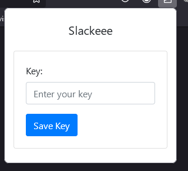
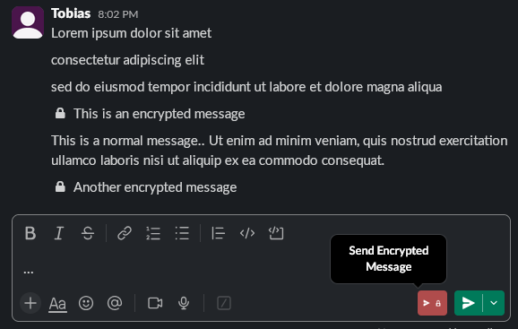
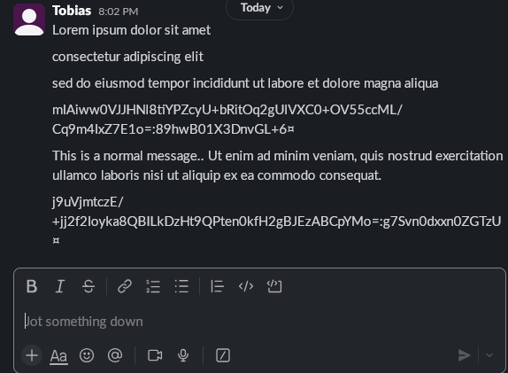

# Slackeee - Slack End-to-End Encryption

Slackeee is a browser extension designed to enhance privacy in peer-to-peer messages on Slack. By utilizing end-to-end encryption, this extension ensures that only the intended recipients with the correct passphrase can view the encrypted messages.
Excellent for sharing passwords, keys and other sensitive information quickly.

## Usage

You can run this yourself through Firefox, Chrome or Opera in Development Mode. Alternatively, a published (and more up-to-date) version of this extension exists on the Firefox Add-On Store
https://addons.mozilla.org/en-US/firefox/addon/slackeee/

## Screenshots

